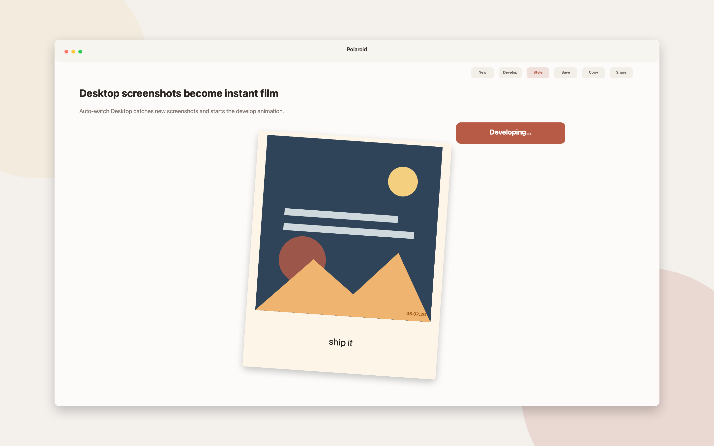

<div align="center">

# 📸 Polaroid

**Mac-native screenshot-to-Polaroid converter with paper grain, develop animation, handwritten captions, and one-click export**

[](https://swift.org)
[](https://developer.apple.com/swiftui)
[](https://www.apple.com/macos)
[](https://github.com/yonaskolb/XcodeGen)
[](LICENSE)

[Features](#-features) · [Getting Started](#-getting-started) · [Verification](#-verification) · [App Store](#-app-store-notes)

</div>

---

<p align="center">
  
</p>

---

## ✨ Features

- **Desktop Screenshot Watcher** — Watches the Desktop for new `Screenshot *.png` and `Screen Shot *.png` files
- **Drag, Drop, Pick, or Paste** — Import images from drag-and-drop, file picker, screenshot watcher, or clipboard
- **Authentic Instant-Film Frame** — Renders the 1080×1320 Polaroid paper ratio with a 980×980 photo well and thick bottom border
- **Programmatic Paper Textures** — Clean white, aged cream, worn, and cool gray paper generated with Core Graphics grain and scuffs
- **Develop Animation** — Paper drops in, then the photo fades from sepia to full color with subtle haptic feedback
- **Handwritten Captions** — Marker Felt, Bradley Hand, or Chalkduster captions with six ink colors and a 60-character limit
- **Caption Tools** — Suggestions, uppercase, lowercase, title case, clear, alignment, vertical position, and size controls
- **Date Stamp** — Optional `MM·DD·YY` red-brown stamp based on the screenshot creation date
- **Export Modes** — Save, Save As, copy PNG, copy file path, or open the macOS share sheet
- **Frame Presets** — Full Polaroid or photo-only export with transparent or matte backgrounds
- **Style Controls** — Paper cycling, ink cycling, font cycling, soft/standard/dramatic shadows, randomize, reset, straighten, and rotation nudges
- **Menu Bar Workflow** — Recent Polaroids, quick import, Desktop rescan, watcher pause/resume, save-folder access, and quit
- **Persistent Settings** — Defaults for paper, ink, font, rotation, caption layout, export size, filename pattern, and save location
- **Local-Only Privacy** — No telemetry, analytics, accounts, cloud sync, or automatic network calls

## 🚀 Getting Started

### Prerequisites

- macOS 14.0 or later
- Xcode 16+
- XcodeGen

```bash
brew install xcodegen
```

### Build & Run

```bash
git clone https://github.com/markksantos/Polaroid.git
cd Polaroid

xcodegen generate
open Polaroid.xcodeproj
```

In Xcode, select the **Polaroid** scheme and run with **Cmd + R**.

You can also build from the terminal:

```bash
xcodebuild -project Polaroid.xcodeproj \
  -scheme Polaroid \
  -destination 'platform=macOS,arch=arm64' \
  build
```

### Daily Use

1. Launch Polaroid.
2. Take a macOS screenshot or drop/paste any image into the window.
3. Let the photo develop.
4. Add a handwritten caption and choose paper, ink, font, shadow, and export style.
5. Save to `~/Pictures/Polaroids`, copy to clipboard, or share.

## ✅ Verification

```bash
xcodebuild -project Polaroid.xcodeproj \
  -scheme Polaroid \
  -destination 'platform=macOS,arch=arm64' \
  test

xcodebuild -project Polaroid.xcodeproj \
  -scheme Polaroid \
  -configuration Release \
  -destination 'platform=macOS,arch=arm64' \
  build

xcodebuild -project Polaroid.xcodeproj \
  -scheme Polaroid \
  -configuration Release \
  -destination 'platform=macOS,arch=arm64' \
  analyze
```

Current verification status:

- Unit tests: 11 tests, 0 failures
- Release build: passing
- Static analysis: passing
- Universal binary: `x86_64 arm64`
- Sandbox entitlements: app sandbox, Pictures read/write, user-selected read/write, app-scope bookmarks

## 🛠️ Tech Stack

| Category | Technology |
|----------|------------|
| Language | Swift 6 |
| UI | SwiftUI |
| State | Observation / `@Observable` |
| Rendering | Core Graphics |
| macOS Integration | AppKit, NSPasteboard, NSSharingServicePicker, DispatchSource file watching |
| Build | XcodeGen, Xcode project |
| Platform | macOS 14+ |

## 📁 Project Structure

```
Polaroid/
├── AppStore/
│   ├── Screenshots/                  # App Store screenshot set
│   ├── generate_screenshots.swift    # Screenshot generator
│   └── metadata.md                   # App Store listing copy
├── Polaroid/
│   ├── Core/
│   │   ├── DevelopAnimation.swift
│   │   ├── ExportService.swift
│   │   ├── PaperTextureGenerator.swift
│   │   ├── PolaroidRenderer.swift
│   │   └── ScreenshotWatcher.swift
│   ├── Models/
│   │   ├── AppSettings.swift
│   │   ├── PolaroidDocumentModel.swift
│   │   ├── PolaroidStyle.swift
│   │   └── Screenshot.swift
│   ├── Resources/
│   │   ├── Assets.xcassets
│   │   ├── Info.plist
│   │   └── PrivacyInfo.xcprivacy
│   ├── Views/
│   │   ├── CaptionEditor.swift
│   │   ├── ContentView.swift
│   │   ├── DropZoneView.swift
│   │   ├── MenuBarContent.swift
│   │   ├── PolaroidView.swift
│   │   ├── SettingsView.swift
│   │   └── StylePickerView.swift
│   ├── Polaroid.entitlements
│   └── PolaroidApp.swift
├── PolaroidTests/
│   ├── PolaroidRendererTests.swift
│   └── ScreenshotWatcherTests.swift
├── project.yml
└── Polaroid.xcodeproj
```

## 🔒 Privacy

Polaroid is local-only by design. It does not include telemetry, analytics, accounts, logins, cloud sync, or automatic network requests. The only outbound link is the optional NoSleepLab link in Settings when the user clicks it.

## 🚢 App Store Notes

- Business model: one-time purchase
- Suggested price: USD 9
- Category: Graphics & Design
- Minimum macOS: 14.0
- Privacy label: no data collection
- Default export folder: `~/Pictures/Polaroids`

Before submission, select the Apple Developer Team in Xcode, archive with **Any Mac / Release**, confirm no network entitlements are present, and upload through Organizer or Transporter.

## 📄 License

MIT License © 2026 Mark Santos
